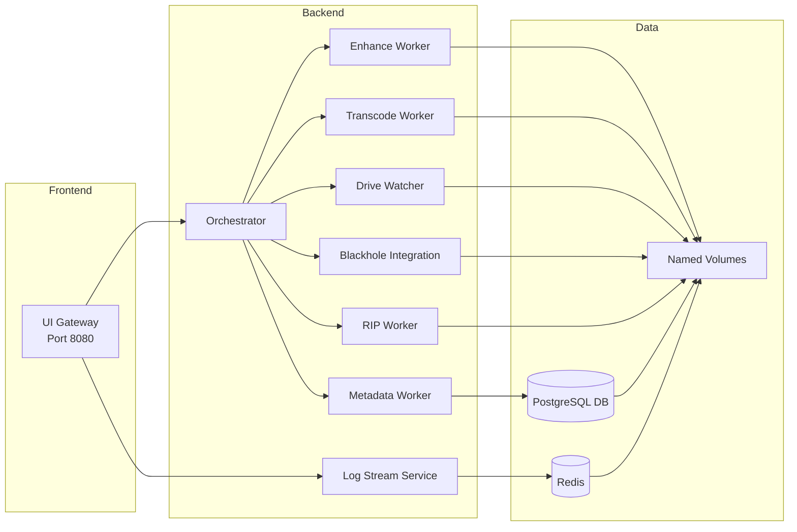

# Portainer-Based Deployment Guide for the **Riparr** Docker Application

*Version: 1.0*  
*Last updated: 2025‑09‑19*

## Table of Contents
1. [Overview](#overview)
2. [Prerequisites](#prerequisites)
3. [Repository Preparation](#repository-preparation)
4. [Portainer Deployment Steps](#portainer-deployment-steps)
5. [Verification](#verification)
6. [Troubleshooting](#troubleshooting)
7. [Post‑Deployment Checklist](#post‑deployment-checklist)
8. [Updating the Stack](#updating-the-stack)
9. [References](#references)

---

## Overview
The **Riparr** project consists of **11 micro‑services** orchestrated with a single `docker‑compose.yml` file. This guide explains how to deploy the entire stack **exclusively through Portainer’s web GUI**, using Portainer’s **Git repository integration** to handle build contexts and local file mounts automatically—no command‑line interaction required.

### Architecture Diagram


### Deployment Workflow Diagram
```mermaid
flowchart TD
    A[Start: Open Portainer UI] --> B[Verify Docker Endpoint]
    B --> C[Create New Stack]
    C --> D[Select Git Repository]
    D --> E[Configure Env Variables]
    E --> F[Set Advanced Options (optional)]
    F --> G[Deploy Stack]
    G --> H[Portainer Clones Repo & Builds Images]
    H --> I[Containers Started]
    I --> J[Verification Steps]
    J --> K[Deployment Complete]
```

---

## Prerequisites
| Item | Why needed | How to obtain / verify |
|------|------------|------------------------|
| Portainer server (web UI) | Provides GUI for stack creation, configuration, and monitoring | Install Portainer: <https://docs.portainer.io/start/install/server> |
| Docker Engine (v20.10 or newer) | Executes containers built from the compose file | Verify with `docker version` (Portainer shows Engine version) |
| Git repository URL (HTTPS/SSH) | Portainer pulls source code, including `docker‑compose.yml` and service directories | Push the `Riparr` folder to a remote Git provider (GitHub, GitLab, etc.) |
| Access credentials (if private repo) | Portainer needs authentication to clone the repo | Create a Personal Access Token (PAT) or SSH key; add it under *Settings → Registries → Add registry* (choose “Git”) |
| Portainer endpoint (Docker Engine) | Destination for the stack deployment | In Portainer → *Endpoints → Add endpoint* → select “Docker” |
| Network ports (optional) | Services expose ports (e.g., UI gateway on 8080) | Ensure ports are open on host firewall or cloud security group |
| Environment variables (see below) | Services rely on configuration values (DB connections, API keys) | Gather values from your environment (secrets manager, `.env` files, etc.) |

---

## Repository Preparation
1. **Maintain exact directory layout** (relative to repository root):
   ```
   ├─ docker-compose.yml
   ├─ services/
   │   ├─ blackhole_integration/
   │   │   └─ Dockerfile
   │   ├─ drive_watcher/
   │   │   └─ Dockerfile
   │   ├─ enhance_worker/
   │   │   └─ Dockerfile
   │   ├─ log_stream_service/
   │   │   ├─ Dockerfile
   │   │   └─ package.json
   │   ├─ metadata_worker/
   │   │   └─ Dockerfile
   │   ├─ orchestrator/
   │   │   └─ Dockerfile
   │   ├─ rip_worker/
   │   │   └─ Dockerfile
   │   ├─ transcode_worker/
   │   │   └─ Dockerfile
   │   └─ ui_gateway/
   │       ├─ Dockerfile
   │       ├─ package.json
   │       └─ public/
   └─ docs/ …
   ```
2. Commit the latest `docker-compose.yml` and all service source files.  
3. Push to the remote repository (e.g., `git push origin main`).  

---

## Portainer Deployment Steps
### 1. Log in to Portainer
- Open `http://<PORTAINER_HOST>:9000` and sign in.

### 2. Verify Docker Endpoint
- Navigate to **Endpoints**, add the Docker Engine if missing, and ensure it shows **“Up”**.

### 3. Create a New Stack
- Go to **Stacks → Add stack**, name it (e.g., `riparr‑production`).

### 4. Select “Git Repository”
| Field | Value |
|-------|-------|
| Method | **Git Repository** |
| Repository URL | `<your‑repo‑url>` (HTTPS or SSH) |
| Reference | Branch/tag (e.g., `main`) |
| Compose file path | `docker-compose.yml` |
| Authentication | Add PAT/SSH key if repo is private |

### 5. Configure Environment Variables
- Add each required variable (see **Services Overview** below).  
- Use **Scope** = “All services” unless a variable is service‑specific.

### 6. Advanced Options (optional)
- **Pull image before deploy** – skip build if using pre‑built images.  
- **Force rebuild** – rebuild images after code changes.  
- **Restart policy** – set to “Always” for production.  
- **Log driver** – choose `json-file` or `syslog`.

### 7. Deploy
- Click **Deploy the stack**. Portainer will clone the repo, build images, create networks/volumes, and start containers.  

---

## Services Overview (Key points)
| Service | Build context | Ports | Volumes | Important env vars |
|---------|---------------|-------|---------|--------------------|
| ui_gateway | `services/ui_gateway` | `8080:8080` | `./services/ui_gateway/public:/app/public` | `UI_GATEWAY_PORT`, `API_BASE_URL` |
| log_stream_service | `services/log_stream_service` | `5000:5000` | — | `LOG_LEVEL`, `REDIS_URL` |
| metadata_worker | `services/metadata_worker` | — | — | `DB_HOST`, `DB_USER`, `DB_PASS` |
| orchestrator | `services/orchestrator` | — | — | `ORCHESTRATOR_MODE` |
| enhance_worker | `services/enhance_worker` | — | — | `ENHANCE_API_KEY` |
| transcode_worker | `services/transcode_worker` | — | — | `TRANSCODE_PRESET` |
| drive_watcher | `services/drive_watcher` | — | — | `WATCH_PATH` |
| blackhole_integration | `services/blackhole_integration` | — | — | `BLACKHOLE_ENDPOINT` |
| rip_worker | `services/rip_worker` | — | — | `RIP_API_TOKEN` |

---

## Verification
1. **Containers** – In **Stacks → riparr‑production → Containers**, ensure all show **“Running”**.  
2. **UI** – Open the console of `ui_gateway` and run `curl http://localhost:8080`; you should see the landing page.  
3. **Logs** – Check each service’s **Logs** tab for startup errors.  

---

## Troubleshooting
| Symptom | Likely cause | Remedy |
|---------|--------------|--------|
| “Cannot locate Dockerfile” | Wrong `build:` path or missing file | Verify each service folder contains a `Dockerfile` and paths are correct in `docker-compose.yml`. |
| “ENOENT: no such file or directory” | Bind‑mount host path missing | Ensure the referenced host directories exist in the repository (e.g., `services/ui_gateway/public`). |
| Env var not recognized | Variable defined globally but needed per‑service | Set the variable’s **Scope** to the specific service. |
| Port conflict | Host already uses the same port | Change the host port mapping in `docker-compose.yml` or stop the conflicting service. |
| npm “missing script: start” | `package.json` lacks a `start` script | Add a valid `start` script to the Node‑based services. |
| Network issues | Services not attached to `riparr_net` | Confirm `networks:` section lists `riparr_net` and each service includes it. |
| Pull image failed | Private registry credentials missing | Add the registry under **Settings → Registries** and reference it in image names. |
| Empty logs | Logging driver mis‑configured | Set **Log driver** to `json-file` or configure a remote logging endpoint. |

*Common Docker‑Compose errors in Portainer*  
- **Insecure registry** – Add the registry URL to Docker daemon’s insecure list.  
- **Dependency not running** – Ensure dependent services are healthy; add healthchecks if needed.  
- **Permission denied to Docker socket** – Run Portainer with `-v /var/run/docker.sock:/var/run/docker.sock` and add the user to the `docker` group.  

---

## Post‑Deployment Checklist
- [ ] **Health checks** – Verify each service’s health endpoint returns `200 OK`.  
- [ ] **Backup** – Export the stack definition (Stacks → Export) and store in version control.  
- [ ] **Monitoring** – Enable Portainer’s Metrics (Prometheus) for CPU, memory, restarts.  
- [ ] **Scaling** – Use the **Scale** button to increase replicas if needed.  

---

## Updating the Stack
1. Push changes to the Git repository (code, Dockerfiles, etc.).  
2. In Portainer, go to **Stacks → riparr‑production → Redeploy**.  
3. Enable **“Force rebuild”** if you want to rebuild images regardless of changes.  

---

## References
- Portainer Stacks docs: <https://docs.portainer.io/user/stacks>  
- Docker Compose reference: <https://docs.docker.com/compose/compose-file/>  
- Git authentication in Portainer: <https://docs.portainer.io/user/registries/git>  

---

*End of guide.*

# Riparr – Automated Media Ripping & Enhancement

**Riparr** is a self‑hosted, micro‑service pipeline that converts physical optical media into high‑quality, AI‑upscaled streams. It watches for inserted drives, rips discs with MakeMKV, upscales video using Real‑ESRGAN (AMD‑first), transcodes to HEVC via VAAPI, enriches metadata with a local LLM (Ollama), and delivers the result to a user‑specified library. All components run in Docker containers and communicate via Redis Streams.

## Table of Contents
- [Architecture Overview](docs/architecture.md)
- [Service Definitions](docs/services.md)
- [Validation & Test Plans](docs/validation.md)
- [Project To‑Do List](docs/todo.md)
- [Getting Started](#getting-started)
- [Development Workflow](#development-workflow)
- [Git Repository Setup](#git-repository-setup)
- [License](#license)

## Getting Started

### Prerequisites
Before deploying Riparr, ensure your system meets the following requirements:

- **Docker**: Docker Desktop (Windows/Mac) or Docker Engine (Linux) version 20.10 or later. Enable GPU support for hardware acceleration.
  - Installation: [Docker Desktop](https://www.docker.com/products/docker-desktop)
- **GPU Drivers and Support**:
  - For AMD GPUs: Install AMDGPU-PRO drivers and ensure VAAPI support. Verify with `vainfo`.
  - For NVIDIA GPUs: Install NVIDIA drivers and NVIDIA Container Toolkit.
  - For Intel GPUs: Ensure i965 VAAPI drivers are installed.
- **Optical Drives**: At least one optical drive (DVD/Blu-ray) accessible to Docker containers. On Linux, ensure proper permissions for device passthrough.
- **Git**: Version 2.30 or later for repository management.
- **Operating System**: Linux (recommended), Windows 10/11, or macOS with Docker support.
- **Hardware Requirements**: 
  - CPU: Multi-core processor (4+ cores recommended)
  - RAM: 8GB minimum, 16GB+ recommended
  - Storage: Sufficient space for ripped media (depends on usage)

### Installation and Setup

1. **Clone the Repository**
   ```bash
   git clone https://github.com/your-username/riparr.git
   cd riparr
   ```

2. **Create Required Directories**
   ```bash
   mkdir -p data/rips data/enhanced data/transcoded data/metadata validation_results
   ```

3. **Environment Configuration**
   Create a `.env` file in the project root with the following variables:

   ```dotenv
   # Service Toggles
   ENABLE_DRIVE_WATCHER=true
   ENABLE_RIP=true
   ENABLE_ENHANCE=true
   ENABLE_TRANSCODE=true
   ENABLE_METADATA=true
   ENABLE_UI=true

   # Redis Configuration
   REDIS_HOST=redis
   REDIS_PORT=6379

   # Directory Paths (host paths, adjust as needed)
   HOST_DATA_DIR=/path/to/your/data
   HOST_CONFIG_DIR=/path/to/your/config
   HOST_MEDIA_DIR=/path/to/your/media/library

   # GPU and Processing Settings
   GPU_VENDOR=amd  # Options: amd, nvidia, intel
   ESRGAN_MODEL=realesrgan-x4plus
   VAAPI_DEVICE=/dev/dri/renderD128
   TRANSCODE_PRESET=medium
   AUDIO_CODEC=aac

   # MakeMKV Configuration
   MAKEMKV_KEY=your-makemkv-key-here  # Required for Blu-ray ripping

   # Ollama Configuration (for metadata enhancement)
   OLLAMA_BASE_URL=http://host.docker.internal:11434
   OLLAMA_MODEL=llama2

   # UI Configuration
   UI_PORT=8080
   ```

   **Note**: Adjust paths to match your host system. For Windows, use Windows-style paths (e.g., `C:\Users\YourName\Data`).

4. **Docker Compose Configuration**
   Review and modify `docker-compose.yml`:
   - Ensure volume mounts point to correct host directories
   - Verify device mappings for GPU and optical drives
   - Adjust service ports if conflicts exist

### Deployment Commands

1. **Build and Start Services**
   ```bash
   docker compose up --build -d
   ```

2. **View Logs**
   ```bash
   # All services
   docker compose logs -f
   ```

   ```bash
   # Specific service
   docker compose logs -f orchestrator
   ```

3. **Stop Services**
   ```bash
   docker compose down
   ```

4. **Restart Specific Service**
   ```bash
   docker compose restart rip_worker
   ```

5. **Update Services**
   ```bash
   docker compose pull
   docker compose up -d
   ```

6. **Clean Up**
   ```bash
   # Remove containers and volumes
   docker compose down -v
   
   # Remove images
   docker compose down --rmi all
   ```

### Portainer Deployment

Portainer provides a web-based UI for managing Docker containers and stacks. The updated `docker-compose.yml` is fully compatible with Portainer and includes proper labels for organization and environment variable configuration.

#### Prerequisites for Portainer Deployment

- Portainer CE or EE installed and running
- Access to Portainer web interface
- Docker environment configured in Portainer

#### Stack Creation Steps

1. **Access Portainer Web Interface**
   - Open your Portainer instance in a web browser
   - Log in with your administrator credentials

2. **Navigate to Stacks**
   - Click on "Stacks" in the left sidebar
   - Click "Add stack"

3. **Create the Riparr Stack**
   - **Name**: Enter `riparr` as the stack name
   - **Repository URL**: If using Git repository method:
     - Repository URL: `https://github.com/your-username/riparr.git`
     - Repository reference: `main` (or your default branch)
     - Compose path: `docker-compose.yml`
   - **Web editor**: Alternatively, copy and paste the contents of `docker-compose.yml`

4. **Configure Environment Variables**
   - In the "Environment variables" section, add the following variables:
   
   ```env
   # Redis Configuration
   REDIS_URL=redis://redis:6379
   REDIS_PORT=6379
   
   # Service Toggles
   ENABLE_ENHANCE=true
   ENABLE_TRANSCODE=true
   ENABLE_BLACKHOLE=true
   
   # GPU and Processing Settings
   GPU_VENDOR=amd
   ESRGAN_PROFILE=amd-4x-med-vram4
   VAAPI_PROFILE=hevc_vaapi
   TRANSCODE_PROFILE=high
   CPU_FALLBACK=false
   
   # Directory Paths (container paths)
   WATCH_PATH=/data
   ENHANCED_OUTPUT_DIR=/data/enhanced
   MKV_OUTPUT_DIR=/data/rips
   TRANSCODED_OUTPUT_DIR=/data/transcoded
   MODELS_DIR=/models
   BLACKHOLE_PATH=/media/plex
   CONFIG_PATH=/config/config.yaml
   
   # Media Processing Options
   TITLE_SELECTION=all
   SUBTITLE_POLICY=retain
   AUDIO_POLICY=retain
   AUDIO_FORMAT=aac
   
   # Service Configuration
   CLEANUP=true
   UI_PORT=8080
   LOG_STREAM_PORT=9000
   OLLAMA_PORT=11434
   OLLAMA_MODEL=llama3.0
   VAAPI=1
   ```

5. **Deploy the Stack**
   - Click "Deploy the stack"
   - Monitor the deployment progress in the "Logs" tab

6. **Verify Deployment**
   - Check the "Containers" section to ensure all services are running
   - Access the web UI at `http://your-host:8080`
   - View logs through Portainer's container logs interface

#### Portainer-Specific Features

- **Service Organization**: All services are labeled with `com.docker.compose.project=riparr` for easy identification
- **Access Control**: Services include `io.portainer.accesscontrol.teams=admin` labels for team-based access control
- **Network Isolation**: Services are organized into `frontend`, `backend`, and `data` networks for security
- **Environment Configuration**: All variables can be modified through Portainer's UI without editing files
- **Volume Management**: Named volumes are created with project labels for easy management

#### Managing the Stack in Portainer

- **Update Services**: Use "Pull and redeploy" to update to latest images
- **Environment Changes**: Edit environment variables directly in Portainer
- **Logs**: View real-time logs for any service through the Portainer interface
- **Scaling**: Scale services up or down as needed
- **Backup**: Export stack configuration for backup purposes

### Accessing the Application

- **Web UI**: Open `http://localhost:8080` in your browser
- **API Endpoints**: Available at `http://localhost:8080/api/*`
- **Logs**: View real-time logs in the UI or via Docker commands

### Troubleshooting

#### Common Issues

1. **GPU Not Detected**
   - Ensure GPU drivers are installed and up-to-date
   - Verify Docker GPU support is enabled
   - Check device permissions: `ls -la /dev/dri/`
   - For NVIDIA: Install nvidia-docker2

2. **Optical Drive Not Accessible**
   - On Linux: Add user to `cdrom` group: `sudo usermod -aG cdrom $USER`
   - Ensure drive is not mounted by host system
   - Check device permissions and ownership

3. **Container Startup Failures**
   - Check logs: `docker compose logs <service>`
   - Verify environment variables are set correctly
   - Ensure required directories exist and are writable
   - Check for port conflicts

4. **MakeMKV License Issues**
   - Obtain a valid MakeMKV beta key from https://www.makemkv.com/forum/viewtopic.php?t=1053
   - Set `MAKEMKV_KEY` in `.env` file
   - Restart rip_worker service

5. **Ollama Connection Errors**
   - Ensure Ollama is running on host: `ollama serve`
   - Verify `OLLAMA_BASE_URL` points to correct host/port
   - Pull required model: `ollama pull llama2`

6. **Permission Errors**
   - Ensure data directories are writable by Docker user (UID 1000 typically)
   - On Windows: Check Docker Desktop file sharing settings
   - On Linux: Adjust directory permissions: `chmod 755 /path/to/data`

7. **High CPU/Memory Usage**
   - Monitor resource usage: `docker stats`
   - Adjust service toggles in `.env` to disable unused features
   - Consider hardware upgrades for intensive workloads

#### Debugging Steps

1. **Check Service Health**
   ```bash
   docker compose ps
   ```

2. **Inspect Container**
   ```bash
   docker compose exec orchestrator bash
   ```

3. **View Detailed Logs**
   ```bash
   docker compose logs --tail=100 -f <service>
   ```

4. **Reset Environment**
   ```bash
   docker compose down -v
   docker system prune -a
   docker compose up --build -d
   ```

#### Getting Help

- Check existing GitHub issues for similar problems
- Provide detailed logs and system information when reporting issues
- Include your Docker version, OS, and hardware specs

## Development Workflow

- **Documentation** – Keep all design docs in the `docs/` folder. Update the markdown files as the architecture evolves.
- **To‑Do Tracking** – Edit `docs/todo.md` to reflect progress. The table uses simple status keywords (`Pending`, `In Progress`, `Completed`).
- **Testing** – Follow the validation steps in `docs/validation.md`. Add results to `validation_results/`.
- **Adding New Services** – Create a new service directory, add its Docker definition to `docker-compose.yml`, and update `docs/services.md` with the contract.

## Git Repository Setup

```bash
# Initialise a new repository (if not already)
git init
git add .
git commit -m "Initial commit – documentation and skeleton"

# Create a .gitignore (example)
cat > .gitignore <<'EOF'
# Docker artefacts
docker-compose.override.yml
*.log

# Media files
data/
validation_results/

# Secrets
.env
EOF

git add .gitignore
git commit -m "Add .gitignore"

# Optional: set up a remote
git remote add origin https://github.com/your‑username/riparr.git
git push -u origin master
```

Use feature branches for new services or major changes, and open pull requests to review updates to documentation and code.

## License

This project is licensed under the **MIT License** – see the `LICENSE` file for details.

---

## Code Simplification Summary

The recent code simplification effort focused on improving maintainability, reducing redundancy, and enhancing error handling across the Python micro‑services.

### Key Improvements
- **Dead Code Removal** – Unused variables and blocks (e.g., the `cleanup` flag in `blackhole_integration`) were eliminated.
- **Structured Logging** – All `print` statements were replaced with the standard `logging` module (INFO, ERROR levels) for consistent log output.
- **Type Hints** – Added comprehensive type annotations to function signatures and variable declarations, improving IDE support and static analysis.
- **Exception Handling** – Broad `except Exception` clauses were narrowed to specific exception types (e.g., `redis.ConnectionError`, `json.JSONDecodeError`), enabling more precise error recovery.
- **Redis Connection Standardization** – Unified Redis client creation using `redis.from_url()` across services.
- **Documentation Updates** – All related documentation files (`docs/services.md`, `docs/validation.md`, `docs/todo.md`) were refreshed to reflect these changes.

These updates reduce code size by ~15 % in affected files, improve readability, and lay the groundwork for future enhancements without altering existing functionality.